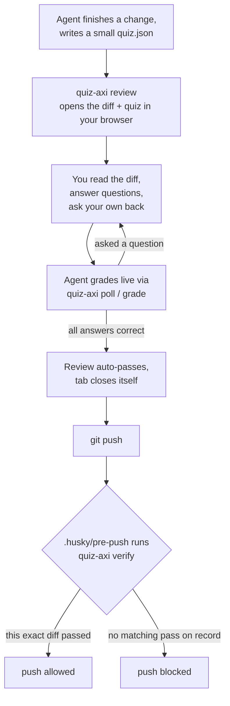

<h1 align="center">quiz-axi</h1>

<p align="center">
  <em>Don't just approve AI-generated code. Understand it.</em>
</p>

<p align="center">
  <a href="#quick-start">Quick start</a> ·
  <a href="#how-it-works">How it works</a> ·
  <a href="#cli-reference">CLI reference</a> ·
  <a href="#architecture-notes">Architecture</a>
</p>

---

AI agents write more and more of the code that ships. **quiz-axi makes sure a human actually understood a change before it goes out** — not just clicked through it.

After an agent finishes a change, it writes a short quiz about that diff, opens it in your browser, and waits. You read the diff, answer the questions (and can ask your own back), and the agent grades you live. Get everything right and the review closes itself. A **husky `pre-push` hook** then refuses `git push` for any diff that hasn't been reviewed and passed — so the check isn't just a suggestion, it's enforced at the door.

## Why

Reviewing an AI-authored diff by skimming and clicking "looks good" doesn't build the mental model you need to debug it later, explain it to a teammate, or catch the one line that's subtly wrong. quiz-axi turns "please review this" into a small, honest comprehension check — anchored to the actual lines that changed — before the change is allowed to leave your machine.

## How it works



- **Content-addressed reviews** — a session is identified by a hash of the diff itself (not a commit SHA), computed the same way at review time and at push time. Edit the code again after passing and the diff changes, so the gate correctly asks for another look — that's not a bug, it's the whole point.
- **The gate needs no live agent or server** — `quiz-axi verify` (what the git hook actually calls) reads the review record straight off disk. You can pass a review during a session on Monday and push on Thursday with nothing running.
- **Grading is always live, never automatic** — `quiz.json` carries no answer key. Even an objectively-correct multiple-choice pick only counts once the agent actually observes and grades it, so a review can't be rubber-stamped the instant it opens.
- **GitHub-style split diff** — changes render as a side-by-side, syntax-colored view with independent old/new line-number gutters, not a single unified column.
- **Answer everything correctly and the review closes itself** — no extra "finish" step required; the browser tab shows a clear pass screen and best-effort closes itself.
- **Ask questions back** — the same conversation panel that delivers your answers also carries free-text questions to the agent and its replies, live.

## Quick start

Requires Node 22+ and [Bun](https://bun.sh) (or npm/pnpm — nothing here is Bun-specific).

```sh
bun install        # also wires the .husky/pre-push hook via the "prepare" script
```

That's it — `git push` in this repo is now gated. To review a change yourself:

```sh
git add <new files you want included>   # untracked files are deliberately excluded, see below
node bin/quiz-axi.js review --quiz /path/to/quiz.json
```

A `quiz.json` is a small file describing questions about the current diff:

```jsonc
{
  "version": 1,
  "diff_summary": "One or two sentences on what changed and why.",
  "questions": [
    {
      "id": "q1",
      "type": "multiple-choice", // or "free-text"
      "prompt": "Why did X change from A to B?",
      "choices": [{ "id": "a", "text": "..." }, { "id": "b", "text": "..." }],
      "hunk_anchor": { "file": "src/foo.js", "start_line": 10, "end_line": 18 } // optional
    }
  ]
}
```

Write it **outside the repo** — it would otherwise become part of the diff it's describing. See the project skill at [`.claude/skills/quiz-axi/SKILL.md`](.claude/skills/quiz-axi/SKILL.md) for the full agent-facing workflow (this is what makes `/quiz-axi` work in Claude Code).

## CLI reference

| Command | Description |
| --- | --- |
| `quiz-axi review --quiz <quiz.json> [--base <ref>] [--no-open]` | Open a review session for the current diff (working tree vs. the resolved base branch). |
| `quiz-axi poll <diff_key> [--agent-reply "..."]` | Long-poll until the human answers, asks something, or ends the session. |
| `quiz-axi grade <diff_key> --question <id> --verdict correct\|incorrect [--feedback "..."]` | Record a live verdict for one answered question. |
| `quiz-axi grade <diff_key> --finish pass\|fail [--summary "..."]` | Seal the review record `verify` checks. Requires every question graded to pass. |
| `quiz-axi end <diff_key>` | End a review session as the agent. |
| `quiz-axi verify` | What `.husky/pre-push` actually calls — reads the review record off disk, no server required. |
| `quiz-axi stop [--port <port>]` | Shut down the background server. |
| `quiz-axi server [--port 4388] [--verbose]` | Run the local server in the foreground. |
| `quiz-axi setup hooks` | Install *agent* SessionStart ambient-context hooks (Claude Code, Codex, OpenCode) — unrelated to the *git* hooks in `.husky/`. |

### Environment variables

| Variable | Default | Purpose |
| --- | --- | --- |
| `QUIZ_AXI_PORT` | `4388` | Local server port. |
| `QUIZ_AXI_HOST` | `127.0.0.1` | Bind address. A wildcard exposes an unauthenticated local server — only do this on a trusted network. |
| `QUIZ_AXI_LINK_HOST` | bind address | Hostname written into generated session URLs. |
| `QUIZ_AXI_STATE_DIR` | `~/.quiz-axi` | Where `state.json` and `server.log` live. |
| `QUIZ_AXI_NO_OPEN` | unset | Skip auto-opening a browser window. |
| `QUIZ_AXI_IDLE_TIMEOUT_MS` | `1800000` (30m) | Self-shutdown timeout with nothing connected. `0`/`off` disables it. |
| `QUIZ_AXI_BASE_BRANCH` | resolved automatically | Force the base branch `review`/`verify` diff against. |
| `QUIZ_AXI_DEBUG` | unset | Verbose server logging. |

## Architecture notes

- **Diff identity**: `sha256(repoRoot + "\n" + diffText).slice(0, 16)`. Stable across a rebase that reproduces identical content (git blob hashes are pure content hashes); changes the instant real content changes.
- **Base resolution** (`review`, `verify`, and the push-time hook all use the *same* logic): `--base`/`QUIZ_AXI_BASE_BRANCH` → `@{upstream}` → `origin/HEAD` → `origin/main` → `origin/master` → local `main` → local `master`. Re-pushing an already-reviewed branch with one more commit re-diffs the *whole branch* against that same base, not just what's new since the last push — so a small follow-up commit correctly requires re-review too.
- **Untracked files are excluded from the reviewed diff** — `git add` anything new you want included. This is what keeps the diff `review` computes identical to what `git push` actually sends; an untracked scratch file (including `quiz.json` itself, if left inside the repo) would otherwise silently ride along into the review but never reach the remote, breaking the gate.
- **No iframe, no sandbox** — unlike artifact-review tools that must safely render arbitrary agent-authored HTML, quiz-axi only ever renders a diff and quiz spec through its own escaped, trusted templates, so the browser chrome renders the page directly with no injected SDK or postMessage protocol.
- Session state lives in `~/.quiz-axi/state.json` as two maps: `sessions` (live review state — chat, answers, score) and `review_index` (the sealed pass/fail record `verify` reads).

## Development

```sh
bun run test     # node --test over test/*.test.js
bun run start    # node bin/quiz-axi.js
```

This is a local, unpublished tool — it runs straight from `src/*.js` with no build step. `bin/quiz-axi.js` is a thin shim around `src/cli.js`.
